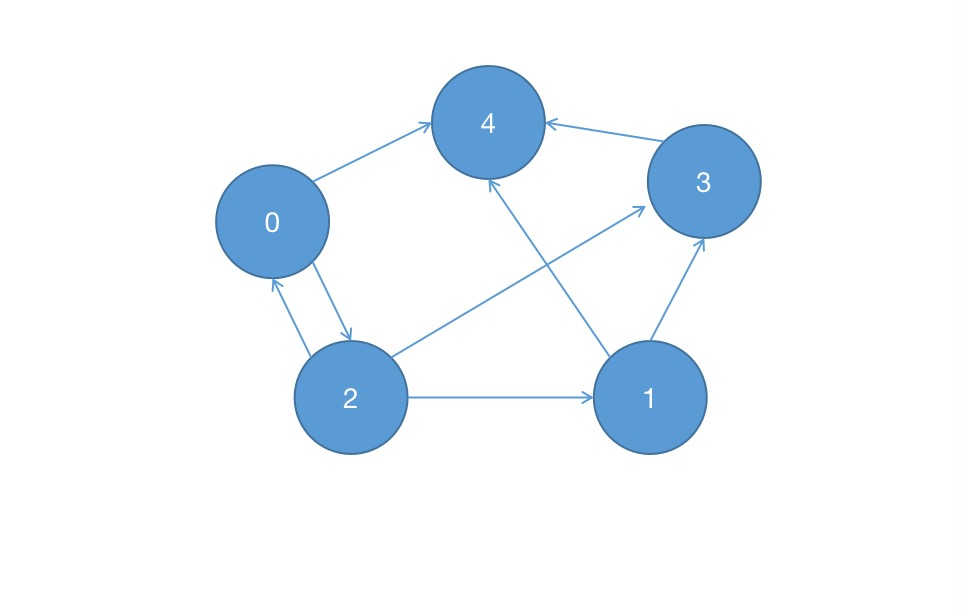

# LCP 07. 传递信息

小朋友 A 在和 ta 的小伙伴们玩传信息游戏，游戏规则如下：

有 n 名玩家，所有玩家编号分别为 0 ～ n-1，其中小朋友 A 的编号为 0
每个玩家都有固定的若干个可传信息的其他玩家（也可能没有）。传信息的关系是单向的（比如 A 可以向 B 传信息，但 B 不能向 A 传信息）。
每轮信息必须需要传递给另一个人，且信息可重复经过同一个人
给定总玩家数 n，以及按 [玩家编号,对应可传递玩家编号] 关系组成的二维数组 relation。返回信息从小 A (编号 0 ) 经过 k 轮传递到编号为 n-1 的小伙伴处的方案数；若不能到达，返回 0。

示例 1：

输入：n = 5, relation = [[0,2],[2,1],[3,4],[2,3],[1,4],[2,0],[0,4]], k = 3

输出：3

解释：信息从小 A 编号 0 处开始，经 3 轮传递，到达编号 4。共有 3 种方案，分别是 0->2->0->4， 0->2->1->4， 0->2->3->4。

示例 2：

输入：n = 3, relation = [[0,2],[2,1]], k = 2

输出：0

解释：信息不能从小 A 处经过 2 轮传递到编号 2

来源：力扣（LeetCode）
链接：https://leetcode-cn.com/problems/chuan-di-xin-xi
著作权归领扣网络所有。商业转载请联系官方授权，非商业转载请注明出处。

## 分析

细细读题，这样的问题可以构建图来解决，我们拿示例 1 做分析，
根据 relation 的关系，在草稿上画出了如下有向图：



从上图 中 从 0 节点 到 4 节点 的路径有

```
0->4        路径长度=1

0->2->1->4  路径长度=3

0->2->3->4  路径长度=3

0->2->0->4  路径长度=3

0->2->1->3->4  路径长度=4
```

可以看到我们符合路径长度为 k=3 的有三种方案。

那怎么统计符合 k 路径长度的方案树呢？我们自然要用到图的深度遍历，或者广度遍历，这里用深度遍历. 具体的思路如下:

- 构建一个二维矩阵表示图
- 对图进行深度遍历

## 构建二维矩阵表示图

```js
const graph = new Array(n);

for (let i = 0; i < n; i++) {
  graph[i] = new Array(n).fill(0);
}

// 构建边与边的关系，有边则 1 ,无边 则 0
for (const [v, u] of relation) {
  graph[v][u] = 1;
}
```

## 图的深度遍历

```js
const targetPoint = n - 1;
let ans = 0;
const dfs = (point, depth) => {
  // 路径长度大于k 递归结束条件
  if (depth > k) return;

  // 符合条件计数
  if (point === targetPoint && depth == k) {
    ans++;
    return;
  }

  for (let i = 0; i < n; i++) {
    // 找相邻点,继续往下遍历
    if (graph[point][i] == 1) {
      dfs(i, depth + 1);
    }
  }
};
```

## 完整实现代码

```javascript
/**
 * @param {number} n
 * @param {number[][]} relation
 * @param {number} k
 * @return {number}
 */
var numWays = function (n, relation, k) {
  const graph = new Array(n);

  for (let i = 0; i < n; i++) {
    graph[i] = new Array(n).fill(0);
  }

  // 构建关系
  for (const [v, u] of relation) {
    graph[v][u] = 1;
  }

  const targetPoint = n - 1;

  // // 深度遍历
  let ans = 0;
  const dfs = (point, depth) => {
    // 防止死循环
    if (depth > k) return;
    if (point === targetPoint && depth == k) {
      ans++;
      return;
    }
    for (let i = 0; i < n; i++) {
      // 找相邻点...
      if (graph[point][i] == 1) {
        dfs(i, depth + 1);
      }
    }
  };

  dfs(0, 0);

  return ans;
};
```
